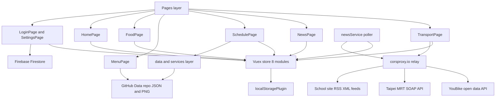
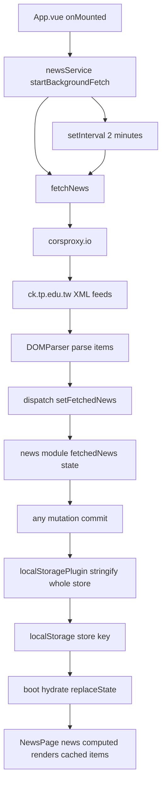

# CK APP — Codebase Evaluation
_Generated 2026-06-24 · 13 review units · produced by a multi-agent review (9 feature + 4 cross-cutting reviewers + synthesis)_

## 1. Executive Summary

**Overall health verdict: Fair, but fragile — ships and works, yet carries serious security debt and pervasive maintainability rot.**

**Overall score: 4.4 / 10** (mean of the 13 unit scores, weighted slightly down for the critical security findings that span multiple units).

CK APP is a functional Quasar/Vue 3 + Capacitor app that successfully aggregates live transit data, school news, cafeteria menus, timetables, and a food map for Chien Kuo students with no real backend — an admirable "data-on-GitHub, public-open-data, localStorage-state" architecture. The store/getter layer is clean and consistently structured across all eight Vuex modules, and the happy path works on every screen. However, the codebase is undermined by a cluster of critical security failures (a real third-party Taipei Metro password and plaintext user passwords committed in source and shipped to every device, the entire user database in one world-readable Firestore document with no security rules in the repo), systemic quality debt (zero automated tests, a no-op `test` script, an unused i18n stack, debug logging of full state on every mutation), and recurring structural problems (1700+-line god-components, copy-pasted fetch/parse/SOAP logic, dead/zombie feature code behind hardcoded `disable` attributes). It is shippable for a student-club app, but the secrets must be rotated and the auth model rethought before any real user data is trusted to it.

## 2. Architecture Overview

The app is a single-page Quasar SPA wrapped in Capacitor for Android/iOS. Every route renders a page under one shared `MainLayout`. Pages read state through Vuex getters and dispatch actions; eight non-namespaced Vuex modules hold all state and are persisted wholesale to `localStorage` on every mutation. Data originates from public open-data APIs (almost always routed through the `corsproxy.io` CORS relay), GitHub raw JSON/PNG assets in a separate Data repo, and a single shared Firebase/Firestore document for user backup. There is no custom backend, which is both the architecture's defining strength and the root cause of its credential-exposure problems.

## 3. Data & Refresh Flow

Two polling loops drive live data. `App.vue` starts `newsService.startBackgroundFetch()` once at app boot; it fetches both school XML feeds immediately and then every 2 minutes, parses `<item>` nodes, and dispatches them into the news module. Separately, `TransportPage` runs its own 10-second interval re-fetching MRT and the heavy YouBike datasets. Every Vuex mutation triggers `localStoragePlugin`, which `JSON.stringify`s the entire store into `localStorage["store"]`; on boot the same plugin parses it back (with no Date reviver, so all dates rehydrate as strings) and `replaceState`-merges it over module defaults.

## 4. Store Module Map

| Vuex module | Persisted | Consuming pages |
|---|---|---|
| `youbike` | localStorage | TransportPage |
| `metro` | localStorage | TransportPage (route `/metro` itself is commented out) |
| `schedule` | localStorage + remote JSON | SchedulePage, SettingsPage, HomePage |
| `todo` | localStorage | TodoPage, SettingsPage, HomePage |
| `food` | localStorage | FoodPage, SettingsPage |
| `news` | localStorage | NewsPage, HomePage (written by newsService) |
| `account` | localStorage (incl. plaintext password) | LoginPage, SettingsPage, HomePage |
| `settings` | localStorage | SettingsPage, MainLayout (footer via `getVisibleMenuItems`) |

## 5. Per-Unit Scorecard

| Unit | Score | One-line assessment |
|---|---|---|
| Account / Login / Firebase | 2 | No real auth; plaintext passwords in Firestore, Vuex, and localStorage; one shared user doc; mostly dead code. |
| X-cut: Security & secrets | 3 | Weakest cross-cut: real Metro password and user passwords shipped to every device, no Firestore rules in repo. |
| Transport (YouBike + MRT) | 4 | Feature-rich but monolithic (~1746 lines), hardcoded MRT credentials, no YouBike error surfacing, wasteful 10s polling. |
| News (School site) | 4 | Clean store/read path, but the live poller's proxy URL is malformed and the page writes to setter-less computeds. |
| Home (aggregator) | 4 | Works for happy path but duplicates schedule logic verbatim, renders wrong todo field, mutates store objects directly. |
| X-cut: Code quality & tests | 4 | Zero tests (no-op `test` script), unused i18n, committed secrets, copy-pasted proxy/SOAP/XML idioms everywhere. |
| Schedule | 5 | Functional but broken period mapping, duplicate class `328`, disabled-yet-wired controls, silent error swallowing. |
| Todo / Calendar | 5 | 1393-line god-component; timezone bug hides multi-day events on their start day; check = permanent delete. |
| Food map | 5 | Works with status-aware markers, but fragile open/closing logic, double-mutated favorites, dead dynamic-fetch code. |
| Menu (Cafeteria) | 5 | Month-boundary crash in the scraper; off-by-one Monday masked by duplicate PNG sets; no 404 fallback. |
| Settings & light pages | 5 | 980-line catch-all with 4x Firebase config, version drift (3.0.1 vs 3.1), unsandboxed Souvenir iframe. |
| X-cut: Architecture & state | 5 | Clean module split and lazy routes, but deep state logging in prod, broken CLEAR_DATA, unsynced persistence. |
| X-cut: Dependencies & build/CI | 6 | Solid gated CI, but unused pinia/vuex-persistedstate deps, version drift, machine-specific path committed. |

## 6. Cross-Cutting Findings

### Architecture
The module decomposition is genuinely clean — one self-contained Vuex module per domain, function-form state factories, lazy-loaded routes, and a data-driven footer via `getVisibleMenuItems`. The persistence strategy is the main weakness: `localStoragePlugin` serializes the **entire** root state synchronously after every mutation (no subset, no throttle, no `try/catch` for `QuotaExceededError`), and `CLEAR_DATA` is excluded from persistence yet `localStorage` is re-synced inconsistently, so a "clear data" can be silently undone on next launch by rehydration. `CLEAR_DATA` also deletes root-level `userClass`/`lastClearedTime` keys that actually live inside the schedule/news modules, so those deletes are no-ops — a symptom of treating non-namespaced modules as a flat global. Hardcoded `/#/...` hash hrefs in `MainLayout` and several pages bypass the router and would break under history mode.

### Security & Secrets
This is the codebase's most serious axis. A **real Taipei Metro account password** (`diegopeng0426@gmail.com` / `Hn2pJ2511N`) is hardcoded three times in `TransportPage.vue` and shipped in every APK/IPA/web bundle, then relayed through public `corsproxy.io`. User passwords are **stored and compared in plaintext** in Firestore, Vuex, and `localStorage`, and logged to console. The **entire user database lives in one shared Firestore document** (`User Data/Userdata`) downloaded in full on every login, with **no `firestore.rules` in the repo** — strongly implying world-readable/writable data. `SouvenirPage` embeds an external auth origin in an **unsandboxed iframe**, and `android:allowBackup="true"` lets the plaintext credentials be extracted via device backup. (The duplicated Firebase web config itself is not a true secret — that part is fine.)

### Dependencies & Build
CI is the healthiest cross-cut: path-filtered triggers, `--frozen-lockfile` installs, secret-based signing, and a clean build/deploy split gated on a `[deploy]` commit prefix. The problems are cruft and drift: `pinia` and `vuex-persistedstate` are declared and locked but **never imported** (the app uses Vuex + a hand-rolled plugin); `package.json` says `3.0.1` while Android/iOS ship `3.1` (three independently-maintained version sources); the `engines.node` range is internally inconsistent (`^22 || ^14.19`) and mismatches the `node16` build target; a developer's machine-specific Android Studio path is committed in `quasar.config.js`; and there is no Renovate/Dependabot for the broad caret ranges.

### Code Quality & Tests
There are **effectively zero automated tests** — the `test` script is `echo "No test specified" && exit 0` and no runner is installed, despite many trivially-testable pure helpers (Haversine, countdown formatting, timestamp parsing, XML parsing, `CLEAR_DATA` reset). The **i18n stack is wired up but unused**; every UI string is an inline Chinese literal. Core idioms are copy-pasted: the `corsproxy.io` wrapper appears ~20 times across 3 files, the SOAP envelope is hand-built 3x, and null-unsafe XML parsing (`item.querySelector('title').textContent`) is duplicated in three places. `storeWatcherPlugin` deep-clones and `console.log`s the full state on **every mutation in production**. Two pages exceed 1300+ lines.

## 7. Prioritized Issues

| Severity | Unit(s) | Issue | File | Recommendation |
|---|---|---|---|---|
| Critical | Transport, Security, Code Quality | Real Taipei Metro account password hardcoded (3x) and shipped in every bundle, relayed via corsproxy.io | `src/pages/TransportPage.vue` (lines 1234-35, 1333-34, 1401-02) | Rotate the credential immediately; move authenticated calls behind a serverless proxy; centralize into one constant; scrub from git history. |
| Critical | Account, Security | User passwords stored and compared in plaintext in Firestore, Vuex, and localStorage (and logged) | `src/pages/LoginPage.vue`, `src/store/modules/account.js` | Use Firebase Authentication; never persist or log passwords; stop writing `Password` to Firestore and `setUserPassword` to localStorage. |
| Critical | Account, Security | Entire user database in one shared Firestore doc, downloaded in full on every login; no security rules in repo | `src/pages/LoginPage.vue`, `src/pages/SettingsPage.vue` | One document per user keyed by Auth uid; add and version `firestore.rules` scoping read/write to `request.auth.uid`. |
| Critical | Menu | `monday_date.replace(day=day+offset)` crashes at month boundaries (`day out of range`) | `src/tools/menu_scraper.py` (line 59) | Use `monday_date + timedelta(days=day_offset)`. |
| Critical | News | Malformed corsproxy URL (`?${enc}` missing `url=`) breaks every background fetch — the only code path that populates the store | `src/services/newsService.js` (lines 19-21) | Change to `?url=${encodeURIComponent(url)}`; define proxy+feed URLs in one shared module. |
| High | News, Home | Pages write to setter-less computeds and mutate store-owned objects directly (silent no-ops / Vuex violations) | `src/pages/NewsPage.vue`, `src/pages/HomePage.vue` | Remove direct writes to computeds; route updates through dispatched mutations. |
| High | News | Entire `NewsPage.fetchNews()` is a dead, divergent duplicate of the service's fetch logic | `src/pages/NewsPage.vue` (lines 273-318) | Delete the local copy; have `revertDeletedNews` call `newsService.fetchNews()`. |
| High | Transport | YouBike fetch errors never surfaced; NTC branch is a detached non-awaited Promise (nondeterministic timing) | `src/pages/TransportPage.vue` (lines 669-783) | Add a `youbikeError` map; await the NTC `Promise.all` inside the try or use `Promise.allSettled`. |
| High | Transport | Single 10s interval re-fetches the full YouBike dataset (4 large requests) every cycle | `src/pages/TransportPage.vue` (lines 1305-1317) | Decouple cadences (MRT 10s, YouBike 60-90s); build an `sna`→station map once instead of `Array.find` per station. |
| High | Schedule, Settings | Class-select dropdown and refresh button hard-`disable`d yet fully wired → large block of dead/zombie code | `src/pages/SchedulePage.vue`, `src/pages/SettingsPage.vue` | Remove the disabled controls and dead handlers, or gate `disable` behind a computed flag. |
| High | Schedule, Home | `isCurrentClass` period array duplicates `五` and omits `八`, so highlight is wrong/never accurate | `src/pages/SchedulePage.vue` (lines 384-88), `src/pages/HomePage.vue` (line 257) | Replace hour-index hack with a real bell-schedule time table; centralize and share. |
| High | Schedule | `loadSchedule` throws (caught, swallowed) when `userClass` key missing in remote JSON; type mismatch (number vs string) | `src/store/modules/schedule.js`, `src/pages/SchedulePage.vue` | Guard `response.data?.[userClass]?.schedule`; normalize `userClass` to a string everywhere. |
| High | Todo | Multi-day events disappear from their own start day due to UTC-parsed date vs local-midnight comparison (Taiwan UTC+8) | `src/pages/TodoPage.vue` (lines 714-19, 869-74) | Compare year/month/date only via a shared `sameDay`/`dateInRange` helper; parse strings as local. |
| High | Todo | Dead ICAL school-events code would `ReferenceError` if re-enabled; central advertised feature is broken dead code | `src/pages/TodoPage.vue` (lines 565, 577-625) | Fully implement or delete `fetchAndParseSchoolEvents` and the comma-expression bug. |
| High | Food | Marker color logic mishandles the `24:00`/late-night hack and multi-range days | `src/pages/FoodPage.vue` (lines 307-341) | Parse hours to minutes-since-midnight once (`24:00`→1440); evaluate status across all ranges. |
| High | Food | `toggleFavorite` double-mutates state (direct `.value.push`/`splice` + dispatch) → duplicate entries | `src/pages/FoodPage.vue` (lines 406-417) | Remove direct array mutation; rely solely on dispatched actions; enable strict mode in dev. |
| High | Home | Wrong todo field rendered (`task.name` vs `task.category.name`) → caption always blank | `src/pages/HomePage.vue` (lines 67-69) | Render `task.category.name`. |
| High | Home, Schedule | Schedule current-class and color logic duplicated verbatim across pages | `src/pages/HomePage.vue`, `src/pages/SchedulePage.vue` | Extract to `src/utils/schedule.js` and import in both. |
| High | Menu | Off-by-one Monday bug masked by writing a second date-shifted PNG set instead of fixing root cause | `src/tools/menu_visualizer.py` (lines 153, 219-20) | Align `MenuPage.getWeekStartDate` with `get_monday_date`; drop `create_previous_date_set`. |
| High | Menu | No real error handling when a menu PNG 404s — broken-image icon with no message | `src/pages/MenuPage.vue` (lines 39-46) | On `@error`, render a friendly `本日無菜單`/`菜單尚未更新` placeholder; consider previous-week fallback. |
| High | Code Quality | Zero automated tests; `test` script is a no-op; no runner installed | `package.json` (line 11) | Add Vitest; unit-test pure helpers; make `yarn test` run and gate deploy on it. |
| High | Code Quality, Architecture | `storeWatcherPlugin` deep-clones and logs the full state on every mutation in production | `src/store/index.js` (lines 12-23) | Remove or gate behind `import.meta.env.DEV`. |
| High | Security, Settings | Firebase init + config duplicated across 5 files; `initializeApp` re-called per operation | `src/pages/SettingsPage.vue`, `src/pages/LoginPage.vue`, `src/boot/firebase.js`, `firebase.js` | Initialize once in a boot module; import `{ db, auth }`; delete redundant inline copies and dead init files. |
| High | Code Quality, News | Null-unsafe XML parsing duplicated across 3 files; one bad `<item>` aborts the whole map | `src/services/newsService.js`, `src/utils/xmlUtils.js`, `src/pages/TransportPage.vue` | Extract one resilient parser (optional chaining, per-item try/catch); use `Promise.allSettled`; delete `xmlUtils.js`. |
| High | Transport, Code Quality | `TransportPage` is a ~1746-line god-component mixing two domains, SOAP building, geo-math, dialogs | `src/pages/TransportPage.vue` | Split into YouBike/Metro components or composables; move pure helpers to `utils/`, district lists to `data/`. |
| High | Code Quality | i18n wired up and booted but unused; all UI strings hardcoded Chinese | `src/i18n/en-US/index.js` | Either remove the i18n dependency or migrate strings into the catalog. |
| High | Security | External auth site embedded in an unsandboxed iframe | `src/pages/SouvenirPage.vue` (lines 4-9) | Prefer the Capacitor Browser plugin; else add tight `sandbox` + `referrerpolicy="no-referrer"`. |
| Medium | Todo | Checking a todo permanently deletes it (no undo, no completed history) | `src/pages/TodoPage.vue` (lines 1035-42) | Keep completed todos or add a Quasar undo notify; replace direct `v-model` mutation with a dispatch. |
| Medium | Transport, Food, Todo, News | Persisted Dates lose their type (no JSON reviver) → string vs Date inconsistency | `src/store/localStoragePlugin.js` | Standardize on ISO strings everywhere or add a reviver; stop pushing live Date objects into the store. |
| Medium | Food | Dead dynamic-fetch code (commented axios, unreachable error branch) after Android revert | `src/pages/FoodPage.vue` (lines 427-447) | Re-enable the GitHub fetch with `try/catch` fallback, or commit to local-only and delete the scaffolding. |
| Medium | Food | Favorites persisted as full restaurant snapshots → stale opening hours + bloat | `src/store/modules/food.js` | Store only a stable id/name; look up the live record at render time. |
| Medium | Architecture, Settings | `CLEAR_DATA` bypasses persistence so stale `localStorage` rehydrates and undoes the clear | `src/store/localStoragePlugin.js`, `src/store/index.js` | Persist `CLEAR_DATA` or `removeItem('store')` inside the clear flow; remove no-op root deletes. |
| Medium | Architecture, Code Quality | Full-state serialization to localStorage on every mutation (no throttle/subset/try-catch) | `src/store/localStoragePlugin.js` | Persist only modules that need it or debounce; wrap `setItem` in try/catch for quota errors. |
| Medium | Transport, Code Quality | `corsproxy.io` wrapper + SOAP envelopes + YouBike fetch copy-pasted across 4+ call sites | `src/pages/TransportPage.vue` | Extract `youbikeService`/`metroService` owning proxy wrapping, endpoints, NTC pagination, and `buildSoapEnvelope`. |
| Medium | Settings, Account, Deps | App version drift: `package.json` 3.0.1 vs Android/iOS 3.1, hardcoded in 3 UI spots | `package.json`, `src/pages/AboutPage.vue`, `src/pages/HomePage.vue` | Single-source the version from `package.json`; bump native build files in lockstep. |
| Medium | Deps | `pinia` and `vuex-persistedstate` declared and locked but never imported | `package.json` | Remove both deps and regenerate `yarn.lock`. |
| Medium | News | 2-minute `setInterval` never cleared, id discarded, no double-start guard | `src/services/newsService.js` (lines 7-10) | Store the id; add `stopBackgroundFetch()`; guard against stacking; pause on app background. |
| Medium | Schedule | `loadSchedule` swallows all errors with no feedback, yet caller shows a green success toast | `src/store/modules/schedule.js` | Return/throw a status; only notify success on actual success (follow `regenerateSchedule`). |
| Medium | Menu | Hardcoded sheet structure + unguarded `int(float(price))` crashes on non-numeric (e.g. `時價`) | `src/tools/menu_scraper.py` | Validate/skip out-of-range rows; guard price conversion; centralize column layout. |
| Medium | Settings | Import defaults omit promo/souvenir menu items, silently dropping toolbar buttons | `src/pages/SettingsPage.vue` (lines 479-513) | Import canonical defaults from the settings store module instead of re-declaring. |
| Medium | Architecture, Deps | Dead scaffolding shipped: unused i18n + axios boot files, `EssentialLink`, disabled `/metro` module/route | `src/boot/i18n.js`, `src/boot/axios.js`, `src/router/routes.js` | Remove unused boot entries, components, and module registration unless features are planned. |
| Low (many) | Various | Leftover debug `console.log`/credential logging, dead code, mixed-language strings, magic numbers, duplicate object keys, duplicate `328` class, `target="_blank"` without `rel="noopener"` | Multiple | Strip debug logs (add `eslint no-console`), delete dead code, name magic constants, add `rel="noopener noreferrer"`. |

## 8. Strengths

- **Backend-free architecture is coherent and mostly delivers on its promise**: public open-data APIs, GitHub raw assets for menus/schedules/restaurants, and a stable filename convention mean most content updates without an app redeploy.
- **Clean, idiomatic Vuex layer**: eight self-contained modules with clear mutation/action/getter separation, function-form state factories, immutable-style updates, and getters consumed consistently by pages (the `todo`, `news`, and `settings` modules are exemplary).
- **Real domain knowledge in the hard parts**: dual-format YouBike timestamp/field handling across two cities, the Wenhu/Bannan (BR/BL) interchange line-color heuristic, correct 42-cell calendar grid math, and CJK-aware SVG menu rendering.
- **Solid, intentional CI/CD**: path-filtered triggers, reproducible `--frozen-lockfile` installs, secret-based signing, and a clean build/deploy split gated behind a `[deploy]` commit prefix.
- **Reasonable UX guards throughout**: per-station loading/error states, empty-state messages, confirmation dialogs before destructive actions, cache-busting on menu images, and `rel="noopener"` on news links.
- **Defensive graceful degradation** in several read paths (MRT JSON `try/catch` returning `[]`, date re-wrapping at calendar read sites) keeps the app from crashing even where the underlying data model is fragile.
- **The team has already begun the right deprecations** (login/register UI commented out), showing awareness of the auth weaknesses.

## 9. Recommended Roadmap

**Quick wins (low-effort, high-leverage):**
1. **Rotate the leaked Taipei Metro credential** and the Firebase project's exposure assumptions immediately — treat both as compromised. Scrub the credential from source and history.
2. **Fix the News proxy URL** (`?url=`) — one-character class of bug that currently breaks the entire 2-minute polling/caching feature.
3. **Fix the Menu scraper month-boundary crash** (`+ timedelta(days=...)`) — predictable several-times-a-year production crash.
4. **Remove `storeWatcherPlugin`** (or gate behind `import.meta.env.DEV`) and strip credential/state `console.log`s — stops leaking full state and PII to device logs.
5. **Add and commit `firestore.rules`** scoping access; set `android:allowBackup="false"`.
6. **Single-source the app version** and bump `package.json` to 3.1; remove unused `pinia`/`vuex-persistedstate` deps and the dead i18n/axios boot files.
7. **Fix the HomePage wrong-field bug** (`task.category.name`) and add `rel="noopener noreferrer"` to all external links.

**Larger efforts (structural, sequence after quick wins):**
1. **Replace the homegrown auth** with Firebase Authentication and restructure Firestore to one document per user keyed by uid — this resolves the plaintext-password and shared-document criticals together. (Or, per the team's stated plan, remove login entirely and keep all data local.)
2. **Introduce automated testing** (Vitest) covering the pure helpers, then gate the deploy workflow on a real `yarn test`.
3. **Extract shared services and helpers**: a `youbikeService`/`metroService` (proxy wrapping, endpoints, SOAP envelope, NTC pagination), a resilient XML parser, a shared bell-schedule/color util, and shared date helpers (`sameDay`/`dateInRange`). This kills most of the duplication and the timezone/period bugs in one place.
4. **Decompose the two god-components** (`TransportPage` ~1746 lines, `TodoPage` 1393 lines) into per-domain child components/composables, enabling the testing and de-duplication above.
5. **Harden the persistence layer**: scope persistence to needed modules (or debounce), add a Date reviver or standardize on ISO strings, wrap `setItem` in `try/catch`, and fix the `CLEAR_DATA` re-sync so "clear data" cannot be undone by rehydration.
